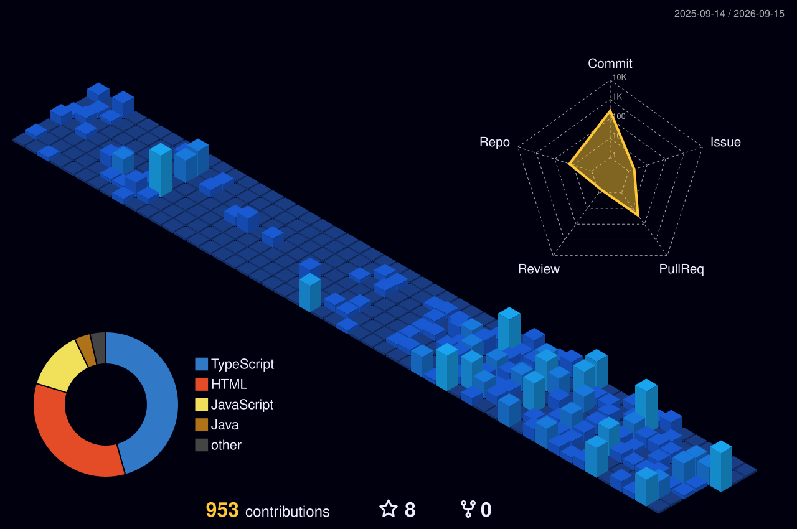

# Hi, I'm Tanishq Saini 👋

### BCA (Honours with Research) Student at Christ University | Aspiring Systems & Software Engineer | Java & Cloud Architecture Enthusiast

---

## About Me

- 🎓 BCA (Honours with Research) student at Christ University, Lavasa
- 💼 Frontend Developer Intern at **The Lev Labs Limited**
- ☕ Building strong foundations in **Java, backend development, databases, and system design**
- 🎮 Previously completed a Game Development Internship at [Eklavya.me](https://www.eklavvya.me)
- 🌱 Exploring cloud architecture and scalable software systems
- 🏆 Winner at multiple university tech events

---

## Tech Stack

### Primary Focus

  

### Secondary Experience

  

### Tools & DevOps

  

---

## LeetCode Progress

<!-- LEETCODE-STATS:START -->
Solved Problems: **10**
<!-- LEETCODE-STATS:END -->

---

## 3D Contribution Graph

  

---

## Connect With Me

